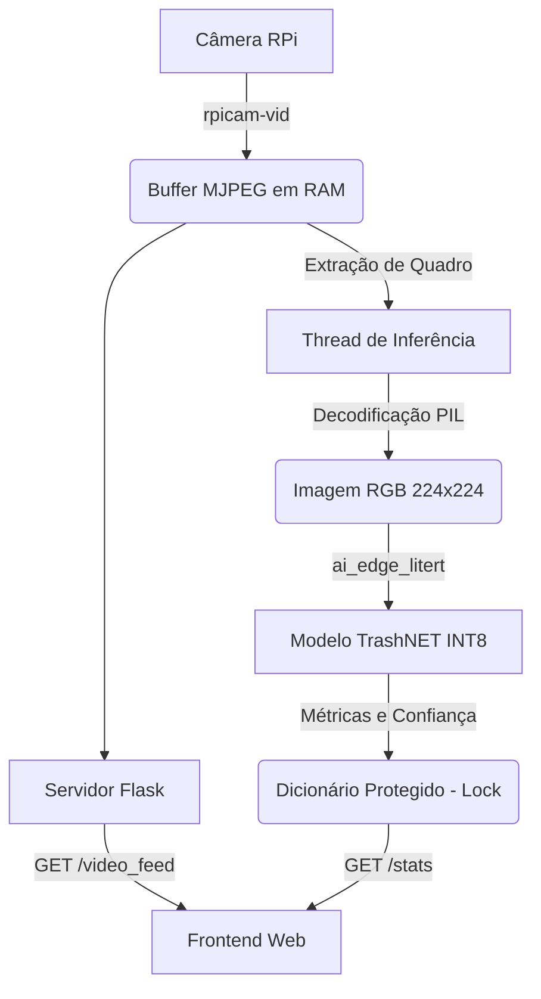

# Classificação Edge - TrashNET INT8 (Raspberry Pi Zero 2W)

O projeto implementa um classificador de resíduos sólidos em tempo real utilizando o modelo convolucional MobileNetV2 quantizado (INT8), otimizado para a arquitetura com restrições de processamento e memória do Raspberry Pi Zero 2W.

## 1. Arquitetura do Sistema

O sistema opera com execução assíncrona, separando o fluxo de vídeo da etapa computacional de inferência neural para evitar estrangulamento da taxa de quadros.



## 2. Configuração de Hardware

* **Placa Microcontroladora**: Raspberry Pi Zero 2W.
* **Módulo de Captura**: Câmera compatível com o subsistema `libcamera` (ex.: Raspberry Pi Camera Module V2).
* **Gestão Térmica**: Dissipador de calor passivo instalado no System-on-Chip (SoC) para evitar *thermal throttling* em operação contínua.
* **Sistema Operacional**: Raspberry Pi OS Lite (64 bits, codinome Bookworm), configurado sem ambiente de área de trabalho para maximização da memória volátil disponível.

## 3. Instalação e Dependências de Software

A configuração do ambiente isola as bibliotecas requeridas através do módulo `venv` do Python.

1. Criação do ambiente virtual na raiz do repositório:
```bash
python -m venv env

```


2. Ativação do ambiente:
```bash
source env/bin/activate

```


3. Instalação dos pacotes via `pip` utilizando o arquivo `requirements.txt`:
```bash
pip install -r requirements.txt

```


4. Execução da aplicação principal:
```bash
python app.py

```


## 4. Documentação da API

O servidor backend Flask opera na porta `5000` e expõe a seguinte interface de programação:

* **`GET /`**
Retorna a interface web principal renderizada em HTML e CSS.
* **`GET /video_feed`**
Fornece o fluxo contínuo de vídeo da câmera no protocolo HTTP de múltiplas partes (`multipart/x-mixed-replace`), encapsulando os quadros em formato JPEG.
* **`GET /stats`**
Retorna um objeto JSON contendo as métricas atualizadas de inferência e hardware. Formato da resposta:
```json
{
  "label": "glass",
  "confidence": 0.930,
  "inference_ms": 172.5,
  "fps": 4.5,
  "cpu_usage": 24.7,
  "cpu_temp": 52.6,
  "active": true
}

```


* **`POST /control/<action>`**
Altera o estado da *thread* de inferência. O parâmetro `<action>` aceita os valores `start` (retoma a classificação) e `stop` (interrompe o processamento neural, mantendo o fluxo de vídeo ativo).

## 5. Desempenho do Sistema

As métricas operacionais foram extraídas durante o monitoramento em tempo real do sistema na interface web, refletindo a capacidade da placa em executar o modelo INT8 em condições reais de iluminação e captura.

* **Detecção de Vidro (Classe: GLASS)**: O classificador obteve níveis de confiança que variaram de 74.6% a 93.0%. A latência associada ao processamento da inferência neural situou-se entre 164.8 ms e 172.5 ms.


* **Detecção de Plástico (Classe: PLASTIC)**: A estabilidade do modelo resultou em uma confiança cravada em 98.4%. A latência computacional para esta classificação manteve-se entre 163.6 ms e 165.5 ms.


* **Monitoramento de Hardware (Telemetria)**:
* A taxa de atualização global alcançou uma faixa de 4.5 FPS a 4.7 FPS.


* O consumo de recursos da CPU flutuou entre 24.7% e 28.2%.


* A temperatura do processador permaneceu na zona operacional segura, registrando medições de 52.6°C a 53.7°C.
